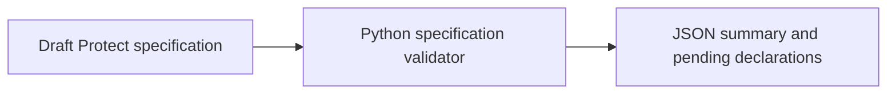

# VGC Rulebreak

[](https://github.com/Builder106/vgc-rulebreak/actions/workflows/ci.yml)
[](https://www.python.org/downloads/)
[](#license)

Which Scarlet/Violet habits cost you games in Champions?

VGC Rulebreak is a research project about competitive Pokemon agents adapting to changed battle rules. The experiments measure which decisions become costly, how training changes those decisions, and whether improvements hold against opponents the agent did not train against.

The first study isolates Protect's 16-versus-8 PP allowance. Later studies cover Rage Fist, Speed, full Champions transfer, and reciprocal Tera/Mega transfer.

## Project status

The scaffold includes a Python CLI, a draft Protect experiment, tests, locked development tools, and CI. Simulator integration, training, results, and the public demo are upcoming work. There are no measured performance claims yet.

Read the [research plan](RESEARCH.md), [roadmap](ROADMAP.md), and [showcase brief](docs/showcase.md).

## Try the scaffold

Use Python 3.12 and uv 0.12.5:

```sh
uv sync --frozen --group dev
uv run vgc-rulebreak check experiments/protect-pp.json
```

The command checks that the study changes only Protect PP, uses an immutable simulator revision, and declares independent training seeds. It reports the four pending readiness declarations. It does not run battles or verify mechanics.

```sh
uv run vgc-rulebreak check experiments/protect-pp.json --require-ready
```

This exits with code 1 while the draft has missing declarations. See [CONTRIBUTING.md](CONTRIBUTING.md) for all checks and exit codes.

## Current flow



## Repository layout

| Path | Contents |
| --- | --- |
| `src/vgc_rulebreak/` | Specification validation and CLI |
| `experiments/` | Versioned study specifications |
| `tests/` | Control-validation and CLI checks |
| `RESEARCH.md` | Questions, controls, evaluation, and sources |
| `ROADMAP.md` | Implementation milestones and exit criteria |
| `docs/showcase.md` | Blunder Replay, Habit Recovery, and Matchup Desk brief |
| `JOURNAL.md` | Decisions behind the project |

Datasets, checkpoints, raw replays, and generated reports are ignored by Git. Add simulator and learning dependencies with their first implementation milestone.

## License

Project code is licensed under [MIT](LICENSE). Third-party simulator code, Pokemon assets, datasets, and model weights retain their own terms.
